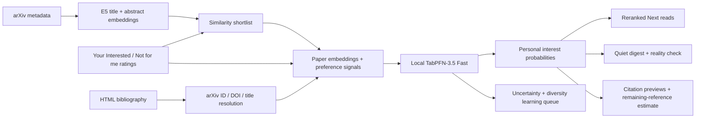
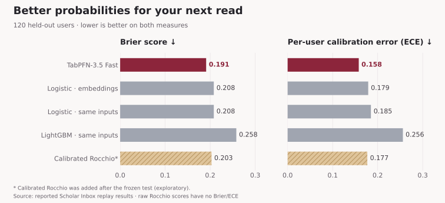

<p align="center">
  
</p>
<p align="center">
  <a href="https://github.com/James-Begin/LensPFN/actions/workflows/ci.yml"></a>
  
  
  
</p>
<p align="center">
  <a href="#demo"><b>Watch the demo</b></a> · <a href="#why-tabpfn-35-fast"><b>Why TabPFN</b></a> · <a href="#set-up-on-arxiv"><b>Try Lens</b></a> · <a href="#features"><b>Features</b></a> · <a href="#how-it-works"><b>How it works</b></a> · <a href="#evidence"><b>Evidence</b></a>
</p>

Lens learns which research papers interest you, then helps you find the next one **without leaving arXiv**. Rate papers, preview citations as you read, and keep a personalized shortlist in the browser side panel. **TabPFN-3.5 Fast** turns your reading history into personal interest probabilities, powering citation matches, a quiet digest, learning suggestions, and a live check of its forecasts—all with local inference and no per-user weight updates.

## Demo

https://github.com/user-attachments/assets/304a96bf-a225-428b-860d-fc199f8b562d

**[Watch or download the full MP4](https://github.com/user-attachments/assets/304a96bf-a225-428b-860d-fc199f8b562d)** · 1:53 · 1080p · 60 fps · original instrumental music

## Why TabPFN-3.5 Fast?

Each reader supplies a small, changing table: one row per rated paper, embedding and preference features as columns, and **Interested / Not for me** as the label. TabPFN uses those labeled rows as context to predict `P(Interested)` for unread papers. New feedback changes that context; Lens does not train a separate neural network for every reader. The implementation explicitly selects **`ModelVersion.V3_5_FAST`**, the smaller, faster 3.5 variant, to support repeated shortlist and citation scoring. [Model selection in Lens](lens/src/lens/feed/rank.py) · [Prior Labs’ 3.5 model guide](https://github.com/PriorLabs/TabPFN).

**Probability quality is the reason to use it here.** In our frozen test, TabPFN-3.5 Fast achieved **0.191 Brier / 0.158 calibration error**, improving both against every pre-registered probabilistic baseline. Those probabilities support “only notify me above 80%,” uncertainty-guided rating suggestions, and an estimate of relevant references still unread. The live reality check lets a reader inspect how forecasts compare with their own feedback. [Evidence and limits](#evidence).

Rocchio remains a useful similarity baseline and has higher ranking AUC in this evaluation. Lens’s contribution is turning TabPFN-3.5 probabilities into decisions throughout the reading workflow, with an explicit check on whether those probabilities earn the reader’s trust.

## Set up on arXiv

Install **[uv](https://docs.astral.sh/uv/getting-started/installation/)** and **Chrome 116+**. Python 3.11+ is required; uv can provision Python if needed.

```sh
git clone https://github.com/James-Begin/LensPFN.git
cd LensPFN/lens
uv sync --locked --extra semantic --extra tabpfn --extra feed
uv run --no-sync python -m lens.feed.bridge --device cpu
```

On Apple Silicon, use `--device mps`; on a CUDA machine, use `--device cuda`. Keep the companion running while using Lens.

1. Open [the local companion](http://127.0.0.1:8765/) and copy its **pairing key** from preferences.
2. Open `chrome://extensions`, turn on **Developer mode**, choose **Load unpacked**, and select `LensPFN/lens/extension/`. Alternatively, extract the [extension ZIP](demo/lens-extension.zip) and select its `extension/` folder.
3. Open [an arXiv paper](https://arxiv.org/abs/2207.01848), then open Lens from the toolbar. The animated setup guides you through **Connect → Interests → Matches → Read**.
4. Rate papers **Interested** or **Not for me**, and choose **Fetch recent arXiv papers** to populate Next reads. On HTML papers, hover a linked citation to preview and save its paper.

Similarity ranking works without a TabPFN token. Match estimates become available with configured model access and **30 ratings, including at least 3 of each kind**. First inference downloads E5 and TabPFN weights; CPU startup can take several minutes. Configure your own TabPFN access in the setup flow and complete any required model-license acceptance with Prior Labs. [Detailed setup and troubleshooting](docs/GETTING_STARTED.md).

<details>
<summary><b>Try a ready-made demo profile</b></summary>

Prepare a **separate demo profile** with 44 illustrative ratings and 300 bundled public paper candidates. Stop the companion first, then run from `LensPFN/lens/`:

```sh
uv run --no-sync python scripts/prepare_demo.py
uv run --no-sync python -m lens.feed.bridge --root .lens-feed-demo --device cpu
```

Pair Lens with this companion’s new key. The helper leaves your normal reading profile intact and refuses to replace an existing demo folder. It does not invent scores or bundle credentials: match estimates still come from your local TabPFN model. The bundled pool avoids an arXiv harvest; first-use model downloads still need network access. [Optional demo setup](docs/DEMO.md).

</details>

## Features

| While you… | Lens helps you… |
| --- | --- |
| **Discover papers** | Rate directly on arXiv abstract pages and see personalized Next reads in the side panel. |
| **Read a paper** | Hover or keyboard-focus HTML citations for the cited title, authors, abstract, and match estimate. Save without losing your place. |
| **Follow an incomplete reference** | Resolve a DOI or title to the closest arXiv version automatically; retain bibliography details and a manual-link fallback. |
| **Keep reading** | Prefetch citation matches on page open, prioritize the hovered citation, and reuse estimates until five rating changes. |
| **Explore a bibliography** | See top matched references and “About N more references you may like” while you read, with scoring coverage and an immediate update after rating. |
| **Check for strong matches** | Opt into **Digest** for local Chrome alerts strictly above 80% match; already rated and previously delivered papers stay quiet. |
| **Check the probabilities** | See **Your 80%+ reality check**: of forecasts at least 80%, you liked X of Y papers you later rated. |
| **Teach Lens what to look for** | Rate up to six varied papers in **Sharpen**, guided by model uncertainty after six ratings with at least two of each kind. |
| **Refine your interests** | Watch the shortlist rerank with smooth movement and staggered arrivals; keep a Library of your ratings. |
| **Start for the first time** | Follow guided setup, with explicit loading states, keyboard support, and reduced-motion behavior. |

<table>
  <tr><th>Next reads</th><th>Citation preview</th></tr>
  <tr>
    <td><a href="docs/figures/lens-shortlist.png"></a></td>
    <td><a href="docs/figures/lens-citation.png"></a></td>
  </tr>
</table>

*Frames from the showcase; scores are illustrative. Try the running extension to inspect live estimates.*

## Put the probabilities to work

- **Sharpen your profile:** open **Sharpen** to rate up to six informative papers. It starts with diverse suggestions. With TabPFN access and at least six ratings, including two of each kind, it combines prediction entropy (uncertainty near 50%), embedding diversity, and relevance to your interests. Each reaction refreshes the queue. Early percentages stay hidden until the normal 30-rating threshold; this is an active-learning heuristic, and faster cold-start learning is not yet established.
- **A quieter digest:** enable **Digest** for alerts when `P(Interested) > 0.8`. **Check now** inspects the latest local scored pool; Chrome also checks every 30 minutes while the browser and companion run. Each qualifying unrated paper is delivered once, after notification creation succeeds. Fetching new arXiv metadata remains a separate action.
- **Your 80%+ reality check:** Lens saves the first genuine forecast before your feedback. For forecasts `p ≥ 0.8` that you later rate, it shows **liked X/Y**, the observed like rate, and the mean forecast. Old Library ratings are never backfilled. This checks your selected rated sample, not calibration across all arXiv; small samples receive a caution.
- **How much is left worth exploring?** On an HTML paper, Lens sums probabilities across distinct resolved, scored, unrated references: `expected likes remaining = Σ pᵢ`. For example, 0.9 + 0.8 + 0.6 gives 2.3 expected likes, displayed as about 2. Rating a reference removes it immediately. Coverage shows scored and unavailable references; the estimate is not a guaranteed count or an assessment of the whole unscored bibliography.

[Feature implementation and validation](docs/research/releases/0.8.0.md) · [Forecast persistence](lens/src/lens/feed/insights.py) · [Learning queue](lens/src/lens/feed/bridge.py).

## How it works



The Chrome extension talks to an authenticated Python companion on `127.0.0.1`. E5 embeds the paper’s **title and abstract**. The ranker adds signals such as similarity to liked/disliked papers, shared authors, and category overlap. Your ratings form TabPFN’s labeled context; its classifier estimates the probability that you will mark a candidate Interested.

Before enough feedback exists, Lens uses a Rocchio similarity ranker and shows no probability. Once ready, TabPFN scores the **300-paper similarity shortlist** and orders it by match. Citation papers can be scored individually outside that shortlist, with their own rating excluded from context. History features use day/session cross-fitting to reduce leakage. [Ranking implementation](lens/src/lens/feed/rank.py) · [Companion](lens/src/lens/feed/bridge.py) · [Benchmark methodology](docs/research/README.md#methodology).

## Evidence

The pre-registered evaluation replayed explicit ratings from **120 held-out Scholar Inbox users**, separate from the 120 development users. Each model ranked papers a user actually rated, using only earlier ratings.

| Model | Brier ↓ | Per-user calibration error ↓ | Ranking AUC ↑ |
| --- | ---: | ---: | ---: |
| **TabPFN-3.5 Fast** | **0.191** | **0.158** | 0.714 |
| Logistic regression on embeddings | 0.208 | 0.179 | 0.696 |
| Logistic regression, same inputs | 0.208 | 0.185 | 0.708 |
| LightGBM, same inputs | 0.258 | 0.256 | 0.669 |
| Tuned Rocchio similarity | — | — | 0.724 |

TabPFN improved probability quality against every pre-registered probabilistic baseline. **We do not claim superior ranking**: the ranking non-inferiority hypothesis was not supported. The evaluation measures reranking among exposed papers, rather than discovery across all arXiv, and benchmark features include paper age while the product omits it.



Brier measures probability error; ECE measures calibration error. **Lower is better for both.** Raw Rocchio produces similarity scores, so these probability metrics do not apply. An exploratory Platt-calibrated Rocchio scored **0.203 Brier / 0.177 ECE / 0.724 AUC**; it was added after the frozen test and is reported separately.

[Frozen test plan](https://github.com/James-Begin/LensPFN/blob/a4e3f6fb3073f93be3a30736630888451fb3cbc2/docs/research/feed-test-preregistration.md) · [Full results, confidence intervals, and exploratory checks](docs/research/results/feedbench.md) · [Cold-start evidence](docs/research/figures/coldstart_table.md) · [Reproduction commands](docs/research/README.md#reproduce-the-benchmark).

## Privacy and current limits

Ratings, interests, and inference stay on your machine. The companion uses local model weights; configuring an access token verifies it with Prior Labs. Reference resolution sends public bibliography DOI/title/text to Semantic Scholar and DataCite. arXiv harvesting and first-use model downloads also require network access. [Data and access details](docs/PRIVACY.md).

Lens currently requires a running local companion and an unpacked Chrome/Chromium extension. Citation previews work in arXiv HTML, and only references with an identifiable arXiv version can receive matches. Automatic reference matching can select the wrong version; inspect its title/source and use the manual-link fallback if needed. Match percentages estimate personal interest, not scientific quality or correctness. Optional desktop alerts run locally through Chrome every 30 minutes while Chrome and the companion are running; there is no hosted notification service or demo account. Alerts use genuine match estimates strictly above 80%, never similarity scores. Sharpen is an uncertainty-and-diversity heuristic; faster cold-start learning has not yet been evaluated. [New feature details and limits](docs/research/releases/0.8.0.md).

## Project guide

| Start here | Contents |
| --- | --- |
| [Demo setup](docs/DEMO.md) | Seeded demo, feature checks, and evidence map |
| [Getting started](docs/GETTING_STARTED.md) | Setup, devices, TabPFN access, troubleshooting |
| [Chrome extension](lens/extension/) | Manifest V3 UI, citations, onboarding, motion |
| [Python companion and ranker](lens/src/lens/feed/) | Authenticated bridge, persistence, embeddings, ranking, reference resolution |
| [Research and benchmark documentation](docs/research/README.md) | Methodology, frozen plan, results, figures, and reproduction |
| [Contributing](CONTRIBUTING.md) | Tests, CI, and extension packaging |

The optional Streamlit feed remains available with `uv run --no-sync streamlit run src/lens/feed/app.py` from `lens/`.

Built for the TabPFN-3.5 hackathon. Lens is an independent project and is not endorsed by arXiv or Prior Labs. Third-party models, metadata, evaluation data, and paper illustrations retain their own terms; see [notices and licensing](NOTICE.md).
