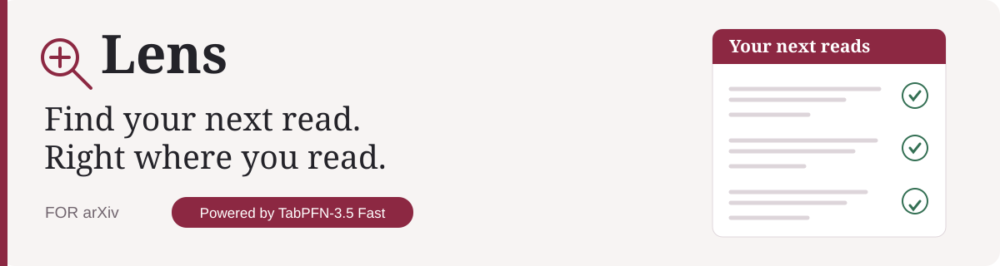
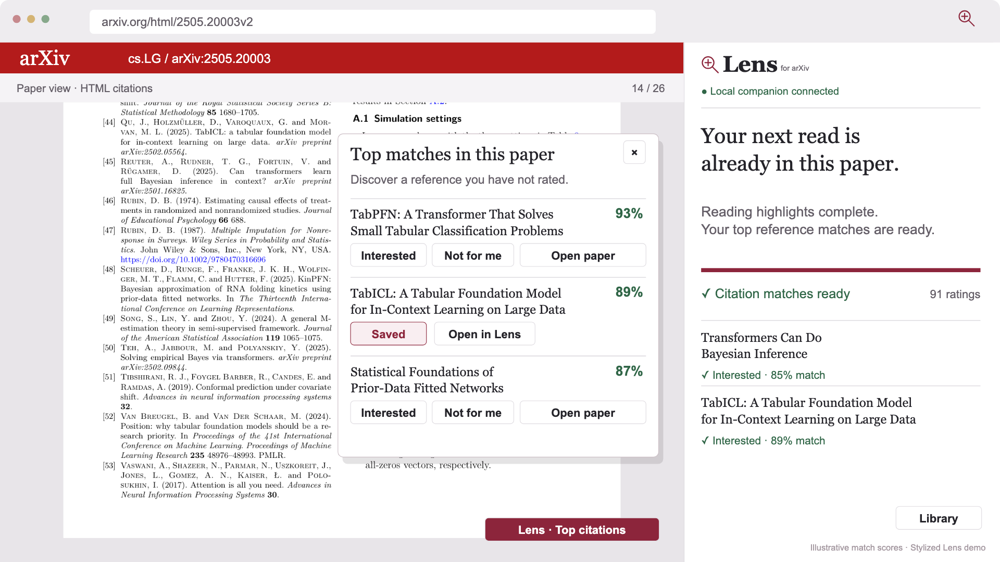
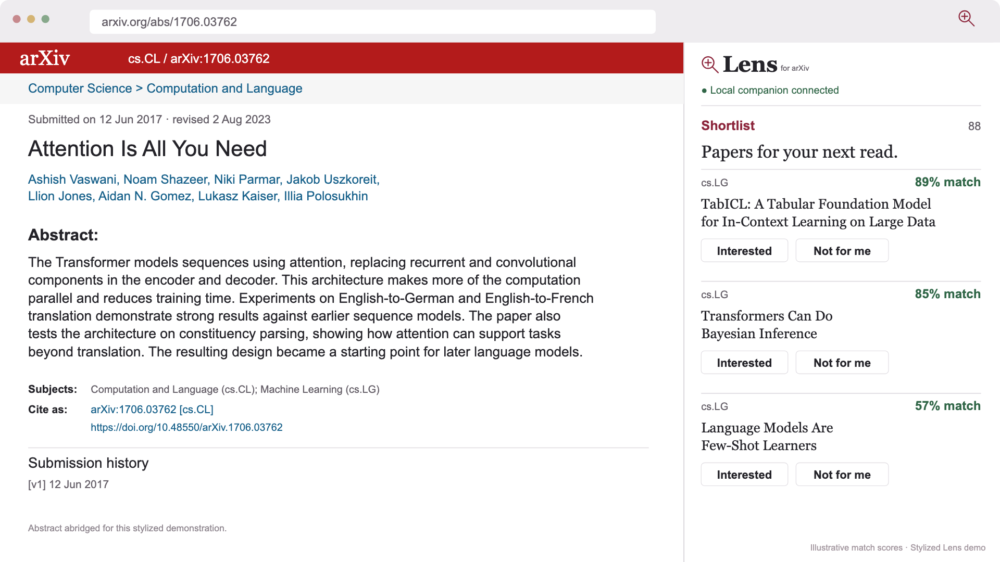
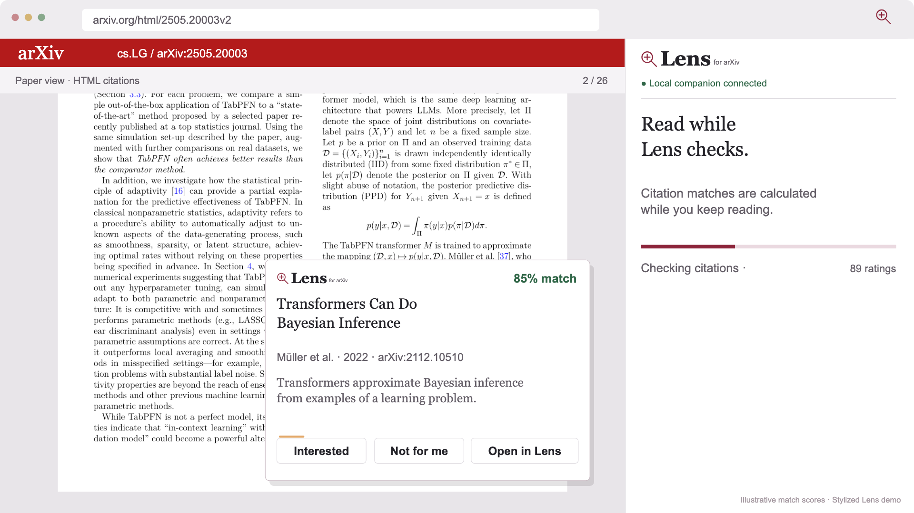
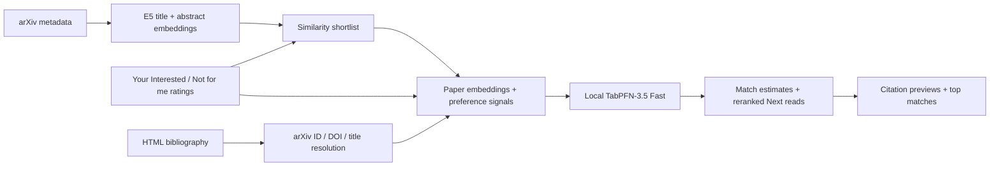
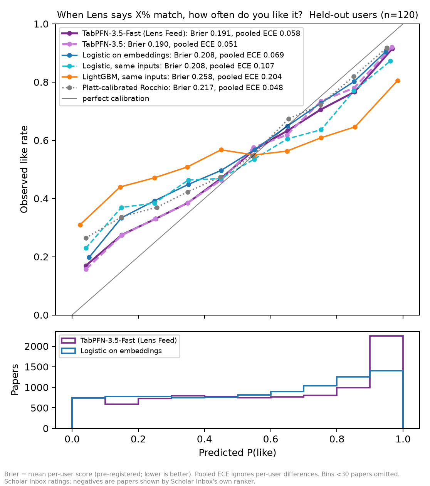

<p align="center">
  
</p>
<p align="center">
  <a href="https://github.com/James-Begin/LensPFN/actions/workflows/ci.yml"></a>
  
  
  
</p>
<p align="center">
  <a href="#demo"><b>Watch the demo</b></a> · <a href="#set-up-on-arxiv"><b>Try Lens</b></a> · <a href="#features"><b>Features</b></a> · <a href="#how-it-works"><b>How it works</b></a> · <a href="#evidence"><b>Evidence</b></a>
</p>

Lens learns which research papers interest you, then helps you find the next one **without leaving arXiv**. Rate papers, preview citations as you read, and keep a personalized shortlist in the browser side panel. **TabPFN-3.5 Fast** turns your reading history into paper match estimates, with no per-user model training.

## Demo

[](https://github.com/James-Begin/LensPFN/raw/refs/heads/main/demo/showcase/Lens-demo.mp4)

**[Watch or download the full MP4](https://github.com/James-Begin/LensPFN/raw/refs/heads/main/demo/showcase/Lens-demo.mp4)** · 1:32 · 1080p · 60 fps · original instrumental music

The film is a stylized walkthrough of the implemented extension. Match percentages and the accelerated rating history are illustrative. Citation interactions represent arXiv **HTML**; native PDF citation hovers are not supported. [Video provenance and chapter guide](demo/showcase/README.md).

## Set up on arXiv

Install **[uv](https://docs.astral.sh/uv/getting-started/installation/)** and **Chrome 116+**. Python 3.11+ is required; uv can provision Python if needed.

```sh
git clone https://github.com/James-Begin/LensPFN.git
cd LensPFN/lens
uv sync --locked --extra semantic --extra tabpfn --extra feed
uv run --no-sync python -m lens.feed.bridge --device cpu
```

On Apple Silicon, use `--device mps`; on a CUDA machine, use `--device cuda`. Keep the companion running while using Lens.

1. Open [the local companion](http://127.0.0.1:8765/) and copy its **pairing key** from preferences.
2. Open `chrome://extensions`, turn on **Developer mode**, choose **Load unpacked**, and select `LensPFN/lens/extension/`. Alternatively, extract the [extension ZIP](demo/lens-extension.zip) and select its `extension/` folder.
3. Open [an arXiv paper](https://arxiv.org/abs/2207.01848), then open Lens from the toolbar. The animated setup guides you through **Connect → Interests → Matches → Read**.
4. Rate papers **Interested** or **Not for me**, and choose **Fetch recent arXiv papers** to populate Next reads. On HTML papers, hover a linked citation to preview and save its paper.

Similarity ranking works without a TabPFN token. Match estimates become available with configured model access and **30 ratings, including at least 3 of each kind**. First inference downloads E5 and TabPFN weights; CPU startup can take several minutes. Configure your own TabPFN access in the setup flow and complete any required model-license acceptance with Prior Labs. [Detailed setup and troubleshooting](docs/GETTING_STARTED.md).

<details>
<summary><b>Try a ready-made demo profile</b></summary>

Prepare a **separate demo profile** with 44 illustrative ratings and 300 bundled public paper candidates. Stop the companion first, then run from `LensPFN/lens/`:

```sh
uv run --no-sync python scripts/prepare_demo.py
uv run --no-sync python -m lens.feed.bridge --root .lens-feed-demo --device cpu
```

Pair Lens with this companion’s new key. The helper leaves your normal reading profile intact and refuses to replace an existing demo folder. It does not invent scores or bundle credentials: match estimates still come from your local TabPFN model. The bundled pool avoids an arXiv harvest; first-use model downloads still need network access. [Optional demo setup](docs/DEMO.md).

</details>

## Features

| While you… | Lens helps you… |
| --- | --- |
| **Discover papers** | Rate directly on arXiv abstract pages and see personalized Next reads in the side panel. |
| **Read a paper** | Hover or keyboard-focus HTML citations for the cited title, authors, abstract, and match estimate. Save without losing your place. |
| **Follow an incomplete reference** | Resolve a DOI or title to the closest arXiv version automatically; retain bibliography details and a manual-link fallback. |
| **Keep reading** | Prefetch citation matches on page open, prioritize the hovered citation, and reuse estimates until five rating changes. |
| **Finish exploring citations** | See up to five top matched references once scoring completes, including papers you have not rated. |
| **Refine your interests** | Watch the shortlist rerank with smooth movement and staggered arrivals; keep a Library of your ratings. |
| **Start for the first time** | Follow guided setup, with explicit loading states, keyboard support, and reduced-motion behavior. |

<table>
  <tr><th>Next reads</th><th>Citation preview</th></tr>
  <tr>
    <td><a href="docs/figures/lens-shortlist.png"></a></td>
    <td><a href="docs/figures/lens-citation.png"></a></td>
  </tr>
</table>

*Frames from the showcase; scores are illustrative. Try the running extension to inspect live estimates.*

## How it works



The Chrome extension talks to an authenticated Python companion on `127.0.0.1`. E5 embeds the paper’s **title and abstract**. The ranker adds signals such as similarity to liked/disliked papers, shared authors, and category overlap. Your ratings form TabPFN’s labeled context; its classifier estimates the probability that you will mark a candidate Interested.

Before enough feedback exists, Lens uses a Rocchio similarity ranker and shows no probability. Once ready, TabPFN scores the **300-paper similarity shortlist** and orders it by match. Citation papers can be scored individually outside that shortlist, with their own rating excluded from context. History features use day/session cross-fitting to reduce leakage. [Ranking implementation](lens/src/lens/feed/rank.py) · [Companion](lens/src/lens/feed/bridge.py) · [Research detail](lens/README.md#how-it-works).

## Evidence

The pre-registered evaluation replayed explicit ratings from **120 held-out Scholar Inbox users**, separate from the 120 development users. Each model ranked papers a user actually rated, using only earlier ratings.

| Model | Brier ↓ | Per-user calibration error ↓ | Ranking AUC ↑ |
| --- | ---: | ---: | ---: |
| **TabPFN-3.5 Fast** | **0.191** | **0.158** | 0.714 |
| Logistic regression on embeddings | 0.208 | 0.179 | 0.696 |
| Logistic regression, same inputs | 0.208 | 0.185 | 0.708 |
| LightGBM, same inputs | 0.258 | 0.256 | 0.669 |
| Tuned Rocchio similarity | — | — | 0.724 |

TabPFN improved probability quality against every pre-registered probabilistic baseline. **We do not claim superior ranking**: the ranking non-inferiority hypothesis was not supported. The evaluation measures reranking among exposed papers, rather than discovery across all arXiv, and benchmark features include paper age while the product omits it.



[Frozen test plan](lens/docs/feed-test-preregistration.md) · [Full results, confidence intervals, and exploratory checks](lens/docs/results/feedbench.md) · [Cold-start evidence](lens/docs/figures/coldstart_table.md) · [Reproduction commands](lens/README.md#reproduce-the-benchmark).

## Privacy and current limits

Ratings, interests, and inference stay on your machine. The companion uses local model weights; configuring an access token verifies it with Prior Labs. Reference resolution sends public bibliography DOI/title/text to Semantic Scholar and DataCite. arXiv harvesting and first-use model downloads also require network access. [Data and access details](docs/PRIVACY.md).

Lens currently requires a running local companion and an unpacked Chrome/Chromium extension. Citation previews work in arXiv HTML, and only references with an identifiable arXiv version can receive matches. Automatic reference matching can select the wrong version; inspect its title/source and use the manual-link fallback if needed. Match percentages estimate personal interest, not scientific quality or correctness. There is no background notification service or hosted demo account.

## Project guide

| Start here | Contents |
| --- | --- |
| [Demo setup](docs/DEMO.md) | Seeded demo, feature checks, and evidence map |
| [Getting started](docs/GETTING_STARTED.md) | Setup, devices, TabPFN access, troubleshooting |
| [Chrome extension](lens/extension/) | Manifest V3 UI, citations, onboarding, motion |
| [Python companion and ranker](lens/src/lens/feed/) | Authenticated bridge, persistence, embeddings, ranking, reference resolution |
| [Research and benchmark documentation](lens/docs/README.md) | Frozen plan, results, figures, and decision history |
| [Showcase assets](demo/showcase/) | Approved MP4, poster, chapters, attribution, and validation |
| [Contributing](CONTRIBUTING.md) | Tests, CI, and extension packaging |
| [Packaging verification](docs/VERIFICATION.md) | Fresh-environment checks, links, ZIP reproducibility, and video identity |
| [Original snapshot](archive/) | Preserved historical ZIP; current source is in `lens/` |

The optional Streamlit feed remains available with `uv run --no-sync streamlit run src/lens/feed/app.py` from `lens/`. Earlier evidence-screening experiments remain in the Python package and are documented in [the research log](lens/README.md#research-log-how-we-got-here).

Built for the TabPFN-3.5 hackathon. Lens is an independent project and is not endorsed by arXiv or Prior Labs. Third-party models, metadata, evaluation data, and paper illustrations retain their own terms; see [notices and licensing](NOTICE.md).
