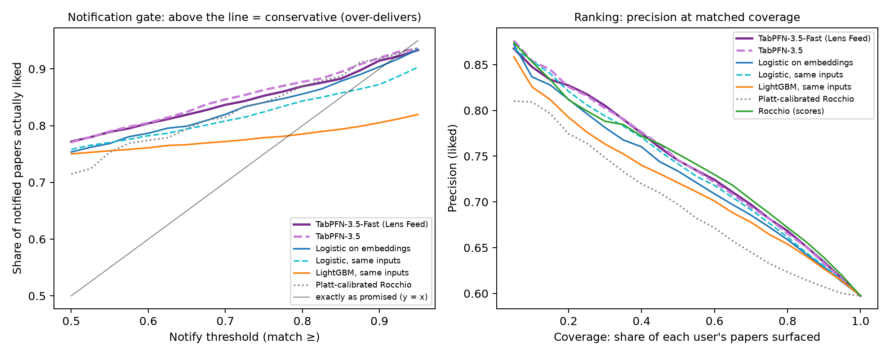
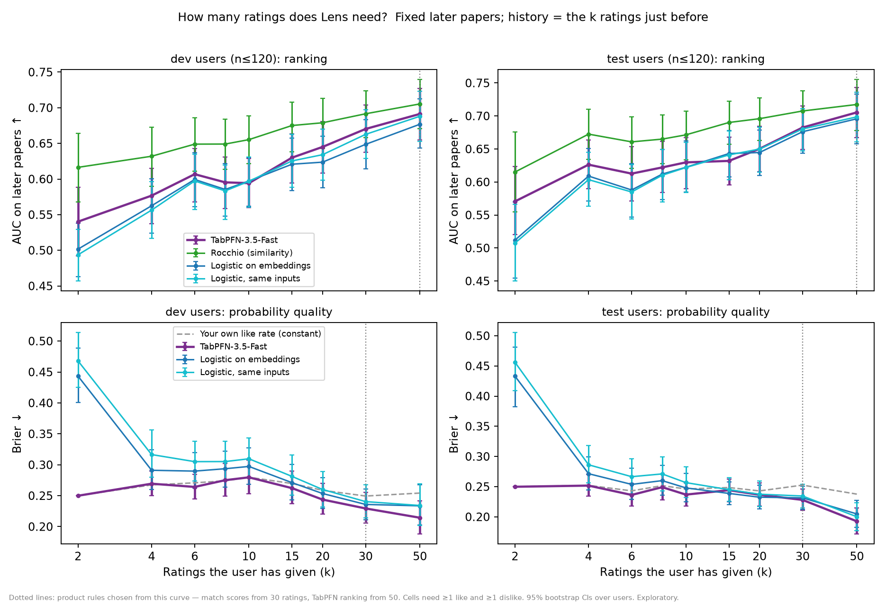

# Evaluation and methodology

[Product and video](../../README.md) · [Full reported results](results/feedbench.md) · [Frozen test plan](feed-test-preregistration.md)

Lens uses TabPFN for personal-interest probabilities. The pre-registered experiment
supports better probability quality against the tested probabilistic baselines;
it does **not** establish superior ranking. It uses 120 held-out Scholar Inbox users,
separate from 120 development users. No new benchmark was run during submission cleanup.

## Methodology

The benchmark replays explicit ratings in time order. The first 30% of a user's ratings
form history; each subsequent day is scored using only earlier ratings. All learners
receive identical history. E5 title/abstract embeddings are combined with preference
signals from liked/disliked papers, authors, and categories. History features use
leave-one-day-out cross-fitting; paper age is measured at rating time. The statistical
unit is the user, with paired bootstrap confidence intervals.

The product omits paper age and falls back to five contiguous rating blocks when
history spans fewer than three days. It starts with Rocchio similarity, then uses
TabPFN-3.5 Fast estimates and shortlist ordering after 30 ratings, including at least
three of each label. Citation scoring excludes the cited paper's own rating. The
exploratory no-age variant retained Brier 0.191 on the same test users.

Scholar Inbox's own ranker selected the exposed papers: results measure reranking
among rated papers, rather than discovery over all arXiv. The earlier TREC-COVID
screening prototype informed the shift toward probability quality; that prototype
and planning notes are preserved in Git history.

## Read the evidence

| Document | What it establishes |
| --- | --- |
| [Frozen test plan](feed-test-preregistration.md) | Learners, hypotheses, statistical unit, and exposure-bias caveat fixed before test evaluation. |
| [Full results](results/feedbench.md) | Test/development metrics, paired intervals, hypothesis outcomes, and separately labeled exploratory baselines. |
| [Cold-start table](figures/coldstart_table.md) | Probability quality versus rating count; rationale for the 30-rating threshold. |
| [Matched-coverage table](figures/gate_table.md) | Exploratory precision comparisons and threshold coverage. |

**Brier and ECE are errors: lower is better. AUC measures ranking: higher is better.**
Raw Rocchio similarity is not a probability, so its Brier/ECE are undefined. The
corrected exploratory `rocplatt:g0.5` baseline has Brier **0.203**, per-user ECE
**0.177**, and AUC **0.724**. It differs from the frozen `roc:logistic` baseline
(Brier 0.217, per-user ECE 0.179).

<details>
<summary><b>Original diagnostic figures and their interpretation</b></summary>


A curve closer to the diagonal is better calibrated. This original export's gray
“Platt-calibrated Rocchio” legend refers to **`roc:logistic`**, the original
Rocchio-feature logistic baseline, not corrected `rocplatt:g0.5`. The generator now
names it explicitly. Its pooled ECE of 0.048 uses a different aggregation from the
pre-registered mean per-user ECE; do not compare it directly with the main table.
The original export is preserved because private predictions are not distributed here.



The same gray-baseline clarification applies. “Notification gate” is an experimental
threshold analysis; the extension has no background notification service.



The figure's 50-rating ranking annotation reflects an earlier product policy. The
current product orders the shortlist by its displayed TabPFN estimate from 30 ratings.
Rocchio ranked better in some cold-start regimes; the product favors a consistent
visible score. See the [underlying table](figures/coldstart_table.md).

</details>

## Reproduce the benchmark

Run from `LensPFN/lens/`. Full replay needs model access, network downloads, and
substantial compute; unit tests require neither. The metadata download is about 3 GB.

```sh
uv sync --locked --extra semantic --extra tabpfn --extra bench
git clone --depth 1 https://github.com/avg-dev/scholar_inbox_datasets .cache/bench/scholar_inbox_datasets
uv run --no-sync lens bench-prepare --ratings .cache/bench/scholar_inbox_datasets/data/rated_papers.csv \
  --output artifacts/feedbench --users 240 --device cuda
uv run --no-sync lens bench-run --bench artifacts/feedbench --split test --device cuda \
  --learners embsig:tabpfnfast embsig:tabpfn rocchio:g0.5 roc:logistic \
  emb:logistic+C0.03 embsig:logistic+C0.1 embsig:lgbm --output artifacts/fbtest/run
uv run --no-sync python scripts/feedbench_report.py artifacts/fbtest
uv run --no-sync python scripts/feedbench_hypotheses.py artifacts/fbtest
uv run --no-sync python scripts/feedbench_figures.py artifacts/fbtest ../docs/research/figures
```

Use `--user-shard k/n` to parallelize; the original replay used eight A10G GPUs.
`lens bench-coldstart --help` describes the separate exploratory rating-count replay.
Learner specifications are in [feedbench.py](../../lens/src/lens/feedbench.py).
Regenerate the README comparison figure without inference:

```sh
uv run --no-sync python scripts/submission_figure.py
```

It reads reported aggregate metrics; it does not reconstruct private predictions or
invent reliability curves. Use a new output directory when replaying, leaving frozen
evidence intact. Scholar Inbox ratings and derived predictions are evaluation-only
and excluded from Git; see [notices](../../NOTICE.md).
